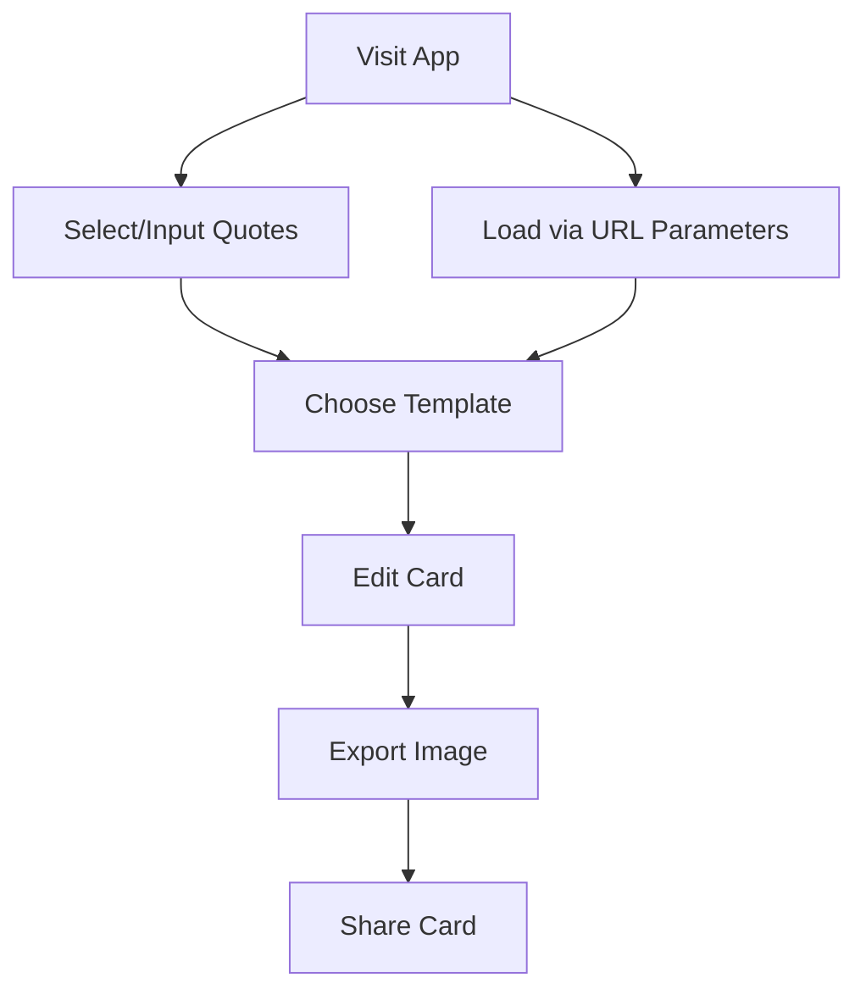

## 1. Product Overview
语录卡片生成工具是一个纯前端应用，允许用户选择语录、选择模板、编辑卡片并导出为图片。
- 解决用户快速创建美观语录卡片的需求，无需后端支持，通过URL参数传递内容。
- 目标用户为需要分享语录、名言的社交媒体用户、内容创作者和教育工作者。

## 2. Core Features

### 2.1 User Roles (if applicable)
| Role | Registration Method | Core Permissions |
|------|---------------------|------------------|
| Normal User | No registration required | Create, edit, and export quote cards |

### 2.2 Feature Module
1. **Home page**: quote selection, template selection, card editor, export functionality

### 2.3 Page Details
| Page Name | Module Name | Feature description |
|-----------|-------------|---------------------|
| Home page | Quote selection | Allow users to input or select quotes, support multiple quotes |
| Home page | Template selection | Provide multiple card templates with different styles |
| Home page | Card editor | Allow users to edit quote text, author, background, colors |
| Home page | Export functionality | Export the card as an image file |
| Home page | URL parameter support | Load quote content via URL parameters |

## 3. Core Process
1. User visits the application
2. User selects or inputs one or multiple quotes
3. User chooses a card template
4. User edits the card content and appearance
5. User exports the card as an image
6. User can share the card or use the URL to load the same content later

## 4. User Interface Design
### 4.1 Design Style
- Primary color: #6366f1 (Indigo)
- Secondary color: #f43f5e (Rose)
- Button style: Rounded with subtle shadow
- Font: Inter for body text, Playfair Display for quotes
- Layout style: Card-based with clean spacing
- Icon style: Simple, minimal line icons

### 4.2 Page Design Overview
| Page Name | Module Name | UI Elements |
|-----------|-------------|-------------|
| Home page | Quote selection | Text input area, quote library dropdown, add/remove quote buttons |
| Home page | Template selection | Grid of template previews, hover effects, selection indicator |
| Home page | Card editor | Live preview of card, text editing fields, color pickers, font options |
| Home page | Export functionality | Export button, download progress indicator |

### 4.3 Responsiveness
- Desktop-first design with mobile adaptation
- Touch optimization for mobile devices
- Responsive layout that adjusts to different screen sizes

### 4.4 3D Scene Guidance (if applicable)
- Not applicable for this project