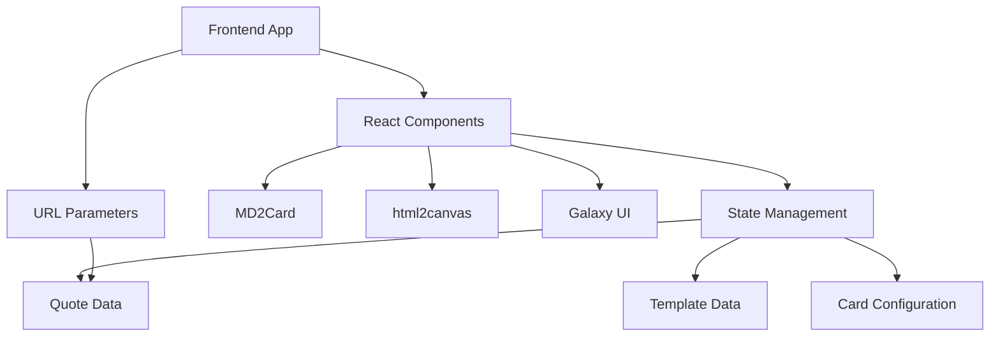
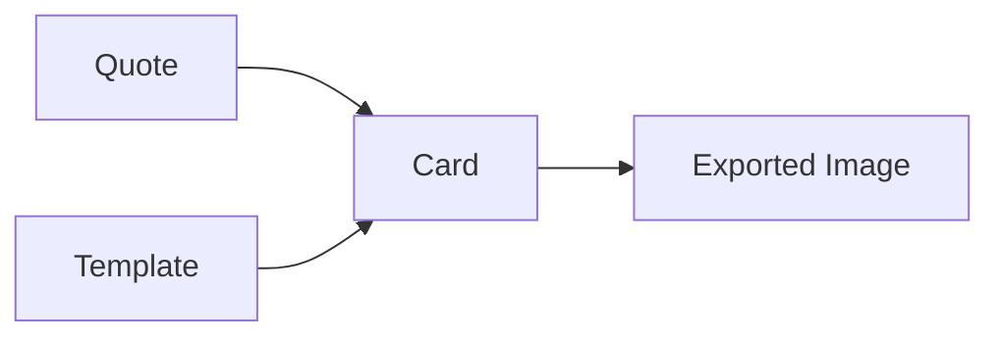

## 1. Architecture Design

## 2. Technology Description
- Frontend: React@18 + TypeScript + Tailwind CSS@3 + Vite
- Initialization Tool: vite-init
- Backend: None (pure frontend solution)
- Dependencies:
  - MD2Card: For markdown to card conversion
  - html2canvas: For card to image export
  - Galaxy UI: For UI components
  - zustand: For state management
  - react-colorful: For color pickers

## 3. Route Definitions
| Route | Purpose |
|-------|---------|
| / | Main application with quote selection, template selection, and card editor |

## 4. API Definitions (if backend exists)
- Not applicable for this project (pure frontend solution)

## 5. Server Architecture Diagram (if backend exists)
- Not applicable for this project (pure frontend solution)

## 6. Data Model (if applicable)
### 6.1 Data Model Definition

### 6.2 Data Definition Language
- Not applicable for this project (pure frontend solution, no database required)

## 7. Key Implementation Details
### 7.1 URL Parameter Handling
- Use URL search parameters to pass quote content
- Format: `?quotes=quote1|quote2|quote3&author=author_name`

### 7.2 Card Templates
- Define multiple template configurations with different styles
- Each template includes background, font, color scheme, and layout options

### 7.3 Export Functionality
- Use html2canvas to capture the card element
- Convert canvas to image and trigger download

### 7.4 State Management
- Use zustand for lightweight state management
- Store quote data, selected template, and card configuration

### 7.5 Responsive Design
- Use Tailwind CSS for responsive layout
- Implement mobile-first approach with breakpoints